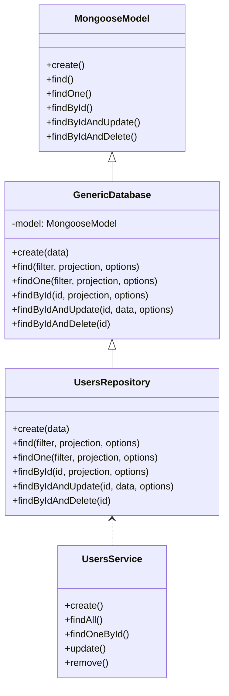

# nestjs-mongoose-generic

A generic, type‑safe data access layer for NestJS applications that use Mongoose and MongoDB. It provides a reusable `GenericDatabase` repository abstraction so you can write less boilerplate and keep your models and services clean.

## Introduction

This package wraps common Mongoose operations in a generic repository class designed for NestJS. You extend `GenericDatabase` for each model and use it inside your services for consistent and concise data access.

## Features

- Generic repository abstraction for Mongoose models in NestJS.
- Strongly typed CRUD methods using TypeScript generics.
- Built‑in support for query filters, projections, sort, and pagination.
- Convenience helpers for `populate` and common Mongoose patterns.
- Simple integration with `@nestjs/mongoose` and existing modules.

## Requirements

- Node.js 16 or newer.
- A NestJS project using TypeScript.
- `mongoose` and `@nestjs/mongoose` installed and configured.
- A running MongoDB instance.

## Installation

Install the package and its peer dependencies using your preferred package manager. The examples assume you already have a NestJS project set up.

### Using npm

```bash
npm install nestjs-mongoose-generic mongoose @nestjs/mongoose
```

### Using pnpm

```bash
pnpm add nestjs-mongoose-generic mongoose @nestjs/mongoose
```

## Usage

This section shows how to define a Mongoose schema, create a repository using `GenericDatabase`, inject it into a NestJS service, and perform CRUD and `populate` operations.

### 1. Define a Mongoose schema

Use `@nestjs/mongoose` decorators or plain Mongoose schemas. The example below uses decorators, a base schema, and creates a typed document interface.

```ts
import { Prop, Schema, SchemaFactory } from '@nestjs/mongoose';
import mongoose, { Document, Types } from 'mongoose';
import { BaseSchema } from './BaseDocument.schema';
import { PrivilegesDocument, PrivilegesSchemaName } from './Privileges.schema';
import { CompanySchemaName } from './Company.schema';
import { DepartmentSchemaName } from './DepartmentModel.schema';
import { BranchSchemaName } from './BranchModel.schame';

export type UserDocument = User & Document;

@Schema({ timestamps: true })
export class User extends BaseSchema {
  @Prop({ required: true, unique: true })
  username: string;

  @Prop({ required: true })
  password: string;

  @Prop()
  firstName?: string;

  @Prop()
  lastName?: string;

  @Prop({ lowercase: true })
  email?: string;

  @Prop({ default: true })
  isActive: boolean;

  @Prop()
  fpQty?: number; // Fingerprint quantity or count

  @Prop({ type: mongoose.Schema.Types.ObjectId, ref: DepartmentSchemaName })
  authorizedDepartment?: Types.ObjectId;
}

export const UserSchema = SchemaFactory.createForClass(User);
export const UserSchemaName = User.name;

UserSchema.set('toJSON', {
  transform: (doc, ret: Record<string, any>) => {
    delete ret.password;
    return ret;
  },
});
```

And an example related schema to demonstrate `populate`:

```ts
// src/companies/schemas/company.schema.ts
import { Prop, Schema, SchemaFactory } from '@nestjs/mongoose';
import { Document } from 'mongoose';

export type CompanyDocument = Company & Document;

@Schema({ timestamps: true })
export class Company {
  @Prop({ required: true })
  name: string;
}

export const CompanySchema = SchemaFactory.createForClass(Company);
```

### 2. Register models in a NestJS module

Register your Mongoose models so they can be injected into services and controllers. This example shows a `UserModule` wired with logging and company support.

```ts
import { Module } from '@nestjs/common';
import { UserController } from './user.controller';
import { UsersService } from './user.service';
import { MongooseModule } from '@nestjs/mongoose';
import { UserSchema, UserSchemaName } from 'src/models/User.schema';
import { LogModule } from 'src/log/log.module';
import { CompanyModule } from 'src/company/company.module';

@Module({
  imports: [
    MongooseModule.forFeature([{ name: UserSchemaName, schema: UserSchema }]),
    LogModule,
    CompanyModule,
  ],
  controllers: [UserController],
  providers: [UsersService],
  exports: [UsersService],
})
export class UserModule {}
```

### 3. Create a repository using GenericDatabase

Extend `GenericDatabase` and pass your document type. Inject the Mongoose model and forward it to the base class.

```ts
// src/users/users.repository.ts
import { Injectable } from '@nestjs/common';
import { InjectModel } from '@nestjs/mongoose';
import { Model } from 'mongoose';
import { GenericDatabase } from 'nestjs-mongoose-generic';
import { User, UserDocument } from './schemas/user.schema';

@Injectable()
export class UsersRepository extends GenericDatabase<UserDocument> {
  constructor(
    @InjectModel(User.name)
    private readonly userModel: Model<UserDocument>,
  ) {
    super(userModel);
  }
}
```

### 4. Inject the repository in a NestJS service

You can also extend `GenericDatabase` directly in your service and use its generic methods. The service below shows minimal create, update, delete, and populate-based read operations.

```ts
// src/users/user.service.ts
import { Injectable } from '@nestjs/common';
import { InjectModel } from '@nestjs/mongoose';
import { FilterQuery, Model } from 'mongoose';
import * as bcrypt from 'bcrypt';
import {
  User,
  UserDocument,
  UserModelConstants,
  UserSchemaName,
} from 'src/models/User.schema';
import { GenericDatabase } from 'src/helper/genericDatabase';
import { CreateUserDto, updateUserDTO } from './dto/CreateUserDTO';

@Injectable()
export class UsersService extends GenericDatabase<Model<UserDocument>> {
  constructor(
    @InjectModel(UserSchemaName)
    private readonly userModel: Model<UserDocument>,
  ) {
    super(userModel);
  }

  async create(createUserDto: CreateUserDto): Promise<UserDocument> {
    const hashedPassword: string = await bcrypt.hash(createUserDto.password, 10);

    const createdUser: User = {
      ...createUserDto,
      password: hashedPassword,
      dateOfJoined: createUserDto.dateOfJoined ?? new Date(),
      isDeleted: false,
      isActive: createUserDto.isActive ?? true,
    };

    return this.genericCreateOne(createdUser);
  }

  async updateSingleUser(
    id: string,
    userDTO: updateUserDTO,
  ): Promise<UserDocument> {
    await this.genericFindOneByIdOrNotFound(id);
    return this.genericUpdateOne(id, userDTO);
  }

  async deleteSingleUser(id: string): Promise<UserDocument> {
    await this.genericFindOneByIdOrNotFound(id);
    return this.genericDeleteOne(id);
  }

  async findOneUser(id: string): Promise<UserDocument> {
    return this.genericFindOneWithPopulate(
      { _id: id } as FilterQuery<UserDocument>,
      {
        path: UserModelConstants.privilegeId,
      },
    );
  }
}
```

### 5. CRUD usage examples

The `GenericDatabase` base class exposes generic CRUD helpers. The methods below show how to call them from within a service that extends `GenericDatabase`.

```ts
// src/users/users.service.ts (CRUD examples)
import { FilterQuery } from 'mongoose';
import { UserDocument } from 'src/models/User.schema';

// Create
async createUser() {
  return this.genericCreateOne({
    username: 'john',
    password: 'plainPassword',
    isActive: true,
    isDeleted: false,
  });
}

// Read many with filters
async listActiveUsers() {
  const filter: FilterQuery<UserDocument> = {
    isActive: true,
    isDeleted: false,
  };
  return this.genericFind(filter);
}

// Read one
async getUserByEmail(email: string) {
  return this.genericFindOne({ email } as FilterQuery<UserDocument>);
}

// Update
async renameUser(id: string, username: string) {
  return this.genericUpdateOne(id, { username });
}

// Delete
async deleteUser(id: string) {
  return this.genericDeleteOne(id);
}
```

### 6. Populate usage examples

You can use `populate` either through Mongoose directly or via generic helpers like `genericFindOneWithPopulate`. The example below shows both approaches.

```ts
// src/users/users.service.ts (populate examples)
import { PopulateOptions } from 'mongoose';
import { UserDocument } from 'src/models/User.schema';

// List users with populated privilege
async findUsersWithPrivileges() {
  const populate: PopulateOptions = {
    path: 'privilegeId',
    select: 'name',
  };

  return this.userModel
    .find({ isDeleted: false })
    .populate(populate)
    .exec();
}

// Single user with populated privilege
async findOneUserWithPrivileges(id: string) {
  return this.genericFindOneWithPopulate(
    { _id: id } as any,
    {
      path: 'privilegeId',
      select: 'name',
    },
  );
}
```

### 7. High‑level architecture

The package fits into a simple repository‑service pattern. The diagram below shows the relationship between key parts.



## Configuration

You configure this package through regular NestJS and Mongoose setup. No dedicated configuration module is required.

### 1. Connect Mongoose in the root module

Configure your MongoDB connection and import feature modules that use `GenericDatabase`.

```ts
// src/app.module.ts
import { Module } from '@nestjs/common';
import { MongooseModule } from '@nestjs/mongoose';
import { UserModule } from './user/user.module';

@Module({
  imports: [
    MongooseModule.forRoot(process.env.MONGO_URI ?? 'mongodb://localhost/app'),
    UserModule,
  ],
})
export class AppModule {}
```

### 2. Common options and patterns

You can pass any standard Mongoose query options into methods exposed by `GenericDatabase`. Use them to configure projections, sorting, limits, skips, and populate behavior.

```ts
// Example: advanced filter and projection
async searchUsers(term: string) {
  return this.genericFind(
    { username: new RegExp(term, 'i') } as any,
    { username: 1, email: 1 },
    { limit: 20, sort: { createdAt: -1 } },
  );
}
```

## Contributing

Contributions are welcome as issues or pull requests on the repository. Please keep changes focused, tested, and documented.

- Open an issue first for large or breaking changes.
- Follow existing code style and TypeScript patterns.
- Add or update tests for new behavior.
- Update this README when you introduce new public APIs.

## License

This project is licensed under the MIT License. You can use, copy, modify, and distribute it under the terms of the MIT license.